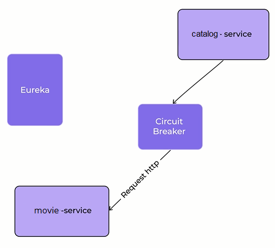

# dh-final-microservicios
patrones de diseño de microservicios implementando Spring Cloud Framework
## Circuit Breaker
- Nuestre chapter lead nos solicita implementar el patrón Circuit Breaker en la comunicación de dos microservicios que actualmente se registran en Eureka y se comunican utilizando Feign

  Ejemplo: `subscription` es el nombre de la instancia de Resilience4j que configuramos en el método `findById`. Cuando buscamos un suscripción y el servicio nos retorna un error, se activará le Circuit Breaker. Y, mediante el uso de un método alternativo a modo de ejemplo, retornamos un mensaje de error. En otro escenario, podríamos buscar en caché la suscripción y retornarla
- Tener en cuenta los posibles errores y aumentar las instancias de los servicios más demandados
- Le Circuit Breaker además publica eventos en un endpoint de Actuator, por ejemplo, las transiciones de estados en `/actuator/circuitbreakerevents`

